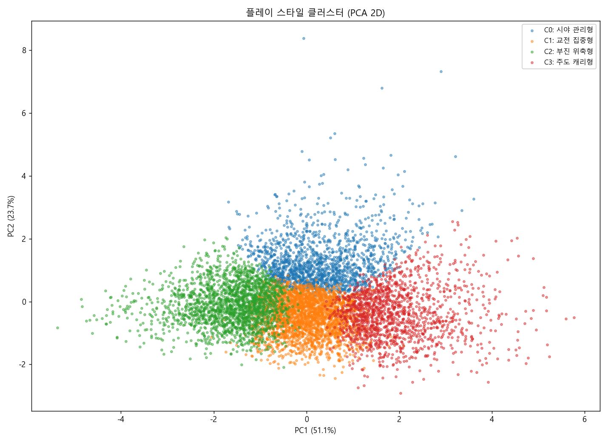
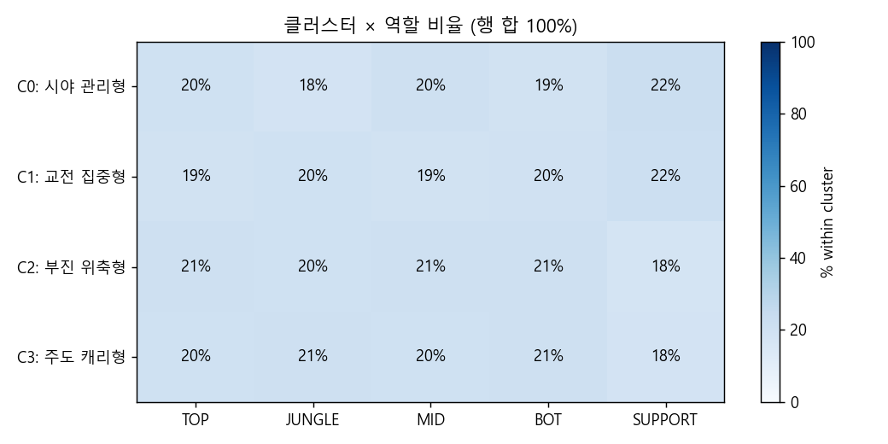

# 리그 오브 레전드 랭크 매치 데이터를 활용한 패치 메타 드리프트 분석과 유저 행동 세그멘테이션

> LoL EUN 솔로듀오 8,358경기를 패치 15.1과 15.3 두 시점에서 비교하여, 챔프의 흥망·유저 행동 페르소나·티어 교란 효과를 SQL과 통계로 분리한 라이브 게임 운영 데이터 분석 프로젝트입니다. 분석이 "사장된 강캐" 후보로 라벨링한 챔프 한 명을 라이엇이 다음 패치에서 실제로 버프하면서, 결과의 외부 정합성까지 확인되었습니다.

<br>

## 1. 프로젝트 개요

| 항목 | 내용 |
|---|---|
| 분석 주제 | 두 패치 사이의 메타 변화 자동 탐지와 유저 행동 K-means 세그멘테이션 |
| 분석 기간 | 2026년 5월 (단독 작업) |
| 데이터 규모 | EUN 솔로듀오 8,358경기 / 83,566행 (패치 15.1 + 15.3) |
| 핵심 도구 | Python · SQLite/SQL · scikit-learn · matplotlib · Riot API V5 · Looker Studio |
| 주요 산출물 | 분석 CSV 11종, 시각화 PNG 3종, Looker Studio 대시보드 설계안, Riot API 수집 파이프라인 PoC |
| 외부 검증 | 분석 신호 ↔ 라이엇 V15.3 공식 패치 노트 7건 일치 |

<br>

## 2. 분석 요약 (Key Findings)

- 분석이 NERF/BUFF 후보로 라벨링한 챔프가 라이엇 V15.3 공식 패치 노트와 **7건 일치**했습니다 (정밀 매칭 6건 + 예측 적중 1건).
- 단순 픽률 변화는 두 데이터셋의 티어 분포 비대칭 때문에 패치 효과를 **최대 2.7배 과대평가**합니다. 코호트 통제와 Wilson 신뢰구간 기반 라벨링으로 *진짜 패치 효과*와 *표본 노이즈*를 분리했습니다.
- 게임 단위 행동 프로필을 K-means(K=4)로 분류한 결과 **4개 페르소나** — 시야 관리형(20%), 교전 집중형(34%), 부진 위축형(27%), 주도 캐리형(19%) — 가 도출되었으며, 모든 페르소나가 5개 포지션을 17~22%로 균등 포함하여 역할 통제가 작동함을 확인했습니다.

<br>

## 3. 배경 및 목적

라이브 게임 운영팀은 매 패치 사이클마다 다음 세 가지 질문을 반복합니다.

1. **메타가 건강한가** — 챔프 풀이 좁아지면 신규 콘텐츠 효과도 함께 감소합니다. HHI · Gini · 유효 챔프 수로 측정 가능합니다.
2. **이번 패치 효과가 진짜인가** — 픽률·승률 변화가 *패치 때문*인지 *표본의 티어 분포가 바뀐 것 때문*인지 구분되지 않으면, 다음 패치의 너프 후보를 잘못 선정할 위험이 있습니다.
3. **유저는 어떤 행동 유형으로 나뉘는가** — 페르소나가 분리되어야 콘텐츠·리워드·리텐션 액션을 유형별로 설계할 수 있습니다.

본 프로젝트는 위 세 질문에 SQL과 통계로 답하는 것을 목표로 하며, "누가 이기는가"와 같은 승부 예측 모델링은 라이브 운영의 질문이 아니라고 판단하여 의식적으로 분석 대상에서 제외했습니다.

<br>

## 4. 데이터

| 데이터셋 | 출처 | 패치 | 게임 / 행 | 가공 |
|---|---|---|---|---|
| `2025.csv` | Kaggle — LoL Ranked S15 (EUN) | 15.3 위주 | 6,285 / 62,847 | 게임 버전 필터, role 캐노니컬화(MIDDLE→MID, BOTTOM→BOT, UTILITY→SUPPORT), 메트릭 재계산 |
| `2024.xlsx` | Kaggle — `league_data` 시트 | 15.1 위주 | 2,073 / 20,719 | `queue_id=420` 솔로듀오 필터 + 동일 캐노니컬화 |
| Riot API V5 | developer.riotgames.com | 실시간 | 20경기 (KR PoC) | 공통 스키마로 적재, puuid 인덱스 추가 |

- 지역은 EUN 한정이며, 시점은 패치 15.1과 15.3입니다 — 연도 비교가 아닙니다.
- 두 캐글 데이터셋의 티어 분포가 다르므로(MASTER+ 22.9% vs 7.0%), 공통 코호트(PLAT+EM+DIA)를 별도로 정의하여 비교의 기준선을 통일했습니다.

### 본문에 자주 등장하는 용어

LoL이나 통계 도메인에 익숙하지 않은 독자를 위해 본문에서 사용하는 약어와 게임 용어를 정리합니다.

| 구분 | 용어 | 의미 |
|---|---|---|
| 게임 시스템 | 챔프(챔피언) | 플레이어가 조작하는 캐릭터. LoL에는 170여 종이 존재 |
| 게임 시스템 | 패치 | 약 2주마다 배포되는 챔프·아이템 밸런스 업데이트 (예: 15.1, 15.3) |
| 게임 시스템 | 솔로듀오 / `queue_id=420` | 1~2인 단위로 참가하는 표준 랭크 큐 |
| 게임 시스템 | 티어 | 실력 등급. 아이언 < 브론즈 < 실버 < 골드 < 플래티넘 < 에메랄드 < 다이아 < 마스터+ |
| 게임 시스템 | role / 포지션 | TOP · JUNGLE · MID · BOT · SUPPORT 5종 |
| 행동 지표 | KDA | (Kill + Assist) / Death — 종합 활약도 |
| 행동 지표 | GPM | Gold Per Minute, 분당 골드 획득 — 자원 운용 |
| 행동 지표 | DPM | Damage Per Minute (챔프 대상) — 딜링 기여 |
| 행동 지표 | KP | Kill Participation, 팀 킬 대비 본인 참여 비율 — 교전 참여도 |
| 행동 지표 | vision score | 시야 점수. 와드(정찰 도구) 설치·제거 활동량 |
| 게임 용어 | NERF / BUFF | 챔프 성능을 약화/강화하는 패치 조정 |
| 게임 용어 | 스노우볼 | 게임 초반 격차가 후반까지 가속되며 한쪽으로 기우는 현상 |
| 통계 | HHI | Herfindahl-Hirschman Index, 시장 집중도 지표. 챔프 픽률 분포의 쏠림 측정 |
| 통계 | Gini | 지니 계수. 분포 불평등도. long tail이 길어지면 상승 |
| 통계 | Wilson 신뢰구간 | 작은 표본에서도 안정적인 비율 신뢰구간 (정규근사의 대안) |
| 통계 | 코호트 (cohort) | 비교 조건을 통제하기 위해 정의한 부분 표본 |
| 통계 | naïve view | 코호트 통제 없이 전체 표본을 그대로 본 비교 |

<br>

## 5. 분석 흐름

분석은 다음 세 부분으로 구성됩니다.

### 5.1 메타 분석 — 패치 드리프트 자동 탐지

두 캐글 데이터셋을 공통 스키마로 하모나이즈하여 SQLite에 정규화 적재한 뒤, SQL CTE · 윈도우 함수로 분석합니다.

- **티어 코호트 통제** — `v_cohort = PLATINUM+EMERALD+DIAMOND`로 좁혀 두 데이터셋의 티어 분포 비대칭을 통제합니다. 통제 없이 본 naïve view도 함께 산출하여 한 표에서 *통제 전후 차이*를 직접 비교할 수 있도록 구성했습니다.
- **자동 NERF/BUFF 플래깅** — 인기 NTILE 분위 × 표본 컷 × 강함 컷의 조합으로 라벨링합니다. BUFF 후보(사장된 강캐)는 정의상 표본이 작으므로 점추정 대신 **Wilson 95% 신뢰구간 하한 ≥ 50%** 로 강함을 정의했고, SQL로 직접 구현했습니다.
- **드리프트 + 신뢰구간** — 챔프별 픽률·승률 차이에 95% CI를 부착하여, *CI가 0을 제외하는 신호만 채택*하는 방식으로 노이즈를 제거합니다.

### 5.2 행동 분석 — K-means 페르소나 추출

게임×참여자 단위 행동 프로필을 비지도 군집화로 4개 페르소나로 분류합니다.

- **역할 내 z-score** — role 원핫은 클러스터가 포지션으로 갈리고, role을 제외하면 SUPPORT의 구조적 GPM 차이가 사라집니다. 그래서 각 역할 내 평균·표준편차로 표준화하여 *역할 안에서의 상대적 성향*만 남겼습니다. 결과적으로 4개 클러스터 모두 5개 role을 17~22%로 균등 포함하여 역할 통제가 작동함을 확인했습니다.
- **결과 신호 제거** — 1차 시도(KDA·deaths 포함)에서 K=2 결과가 *"이긴 게임 vs 진 게임"* 으로 수렴함을 확인했습니다. KDA·deaths가 결과(win)의 강한 proxy임을 진단하고, 프로세스 4지표(GPM · DPM · 시야 · KP)만으로 재군집화했습니다.
- **K 선택** — silhouette 최댓값은 K=2(0.271)이나 자명한 분리에 가까워 채택하지 않았고, inertia 감소가 둔화되는 K=4(silhouette 0.212)를 채택했습니다.

### 5.3 데이터 수집 파이프라인 (Riot API V5)

정적 캐글 데이터 외에 *직접 수집할 수 있음*을 검증하기 위한 PoC입니다. 목적은 대량 수집이 아니라 *파이프라인이 실제로 동작하고 5.1의 공통 스키마로 적재되어 동일한 SQL이 그대로 실행되는 것*까지 확인하는 것입니다.

- Account-v1 (RiotID) → Match V5 → 공통 스키마로 SQLite 적재.
- 토큰 버킷 rate limit 2단(20/sec + 100/2min), 429 Retry-After 백오프, 5xx 지수 백오프.
- `.env` 키 분리와 `.gitignore`로 자격 증명을 격리하고, `X-Riot-Token` 헤더만 사용하여 URL 쿼리에서 키가 노출되지 않도록 했습니다.

<br>

## 6. 주요 결과

### 6.1 라이엇 V15.3 패치 노트와의 정합성

분석이 코호트(PLAT+EM+DIA)에서 NERF/BUFF 후보로 라벨링한 챔프를 라이엇 공식 패치 노트와 대조했습니다.

| 챔프 | 분석 신호 | 라이엇 V15.3 실제 | 정합성 |
|---|---|---|---|
| Wukong | 저묾 1위, 픽률 −0.97pp [CI −1.24, −0.70] | NERF — Warrior Trickster CD↑, Nimbus Strike AS↓ | 정확 |
| Viego | 저묾 3위, 픽률 −0.59pp [CI −0.87, −0.30] | NERF — base AD 60→57 | 정확 |
| Miss Fortune | 저묾 8위, 픽률 −0.43pp | NERF — base armor 28→25 | 정확 |
| Skarner | 저묾 11위 + 승률 −12.8pp | NERF — armor 성장↓, Q 스턴 1.5→1.1s | 정확 |
| Kayn | 떠오름 7위, 픽률 +0.40pp | BUFF — Reaping Slash 데미지↑ | 정확 |
| Quinn | naïve 11위 (교란 효과 사례) | BUFF — Heightened Senses AS 60→80% | 정확 |
| **Swain** | **15.1 BUFF_HIDDEN_STRONG 후보** (MID, n=21, win 81%, Wilson 60%) | **15.3 BUFF** — Ravenous Flock 영혼당 체력 12→15, Nevermove AP비 70%↑ | **예측 적중** |

Swain 사례는 사후 매칭이 아닙니다. 15.1 데이터에서 BUFF 후보가 처음에 0건이 나왔을 때 "사장된 챔프는 표본이 적다"는 정의의 본질과 컷이 자기모순이라는 점을 진단하고, Wilson 신뢰구간 하한 기반으로 컷을 재설계해 발견한 챔프를 라이엇이 다음 패치에서 실제로 버프했습니다. (상세 흐름: `docs/02_phase2_notes.md §9.2`)

매칭되지 않은 신호도 그대로 기록했습니다. XinZhao 승률 +25.5pp는 15.3 패치 노트에 변경이 없어 표본 노이즈로 확정했습니다.

### 6.2 교란 효과 정량화 (cohort vs naïve)

티어 통제 없는 단순 비교(naïve)와 코호트 비교의 순위 차이입니다.

| 챔프 | naïve rank | cohort rank | 해석 |
|---|---|---|---|
| 이즈리얼 | 5위 | 30위 | naïve가 2.7배 과대평가 — 픽률 상승의 대부분은 표본의 고티어 비중 변화 |
| 야스오 | 119위 | 13위 | 둘 다 노이즈 레벨, 순위만 뒤집힘 |
| 케일 | 31위 | 12위 | 코호트에서만 두드러짐 |
| 퀸 | 11위 | top15 밖 | naïve 우대, 그러나 라이엇 실제 BUFF |

### 6.3 메타 다양성 (HHI / Gini, 코호트)

| role | uniq 15.1 → 15.3 | HHI Δ | Gini Δ | 비고 |
|---|---|---|---|---|
| BOT | 62 → 88 | **+0.004** | +0.100 | 다양성·평등성이 함께 악화된 유일한 라인 |
| JUNGLE | 67 → 103 | −0.005 | +0.113 | 상위권 분산, long tail 길어짐 |
| MID | 102 → 132 | −0.003 | +0.055 | 풀 확장 |
| SUPPORT | 75 → 111 | −0.003 | +0.090 | 풀 확장 |
| TOP | 104 → 141 | +0.000 | +0.101 | 평탄 |

전 포지션에서 고유 챔프 수가 증가했고(풀 확장) Gini도 함께 상승했습니다(long tail이 길어짐). 신규 등장 챔프 대부분이 비주류 픽으로 들어왔다는 신호입니다.

### 6.4 4개 행동 페르소나



| C | 페르소나 | 비중 | 승률 | 한 줄 설명 |
|---|---|---|---|---|
| 0 | 시야 관리형 | 20.0% | 52% | 팀 시야 확보·정찰(와드) 활동량이 높은 안정형 |
| 1 | 교전 집중형 | 34.0% | 49% | 교전(한타) 참여는 활발하지만 시야 활동은 낮은 공격형 |
| 2 | 부진 위축형 | 27.0% | 33% | 전반 행동량이 가장 낮은 부진 게임 패턴 |
| 3 | 주도 캐리형 | 19.0% | 76% | 골드 · 챔프 대상 딜 · 교전 기여가 모두 높은 주도적 플레이 |



15.1 → 15.3 비율 변화: 시야 관리형 +3.1pp, 교전 집중형 −4.3pp, 부진 위축형 −0.2pp, 주도 캐리형 +1.4pp.

<br>

## 7. 활용 시나리오 및 제언

분석 결과를 라이브 운영 의사결정에 바로 연결할 수 있는 형태로 정리했습니다.

| 액션 | 근거 | 산출물 |
|---|---|---|
| 다음 패치 NERF 후보 자동 플래깅 (총 85건) | 인기 quartile=4 + n≥30 + WR≥52% | `outputs/champion_meta.csv` flag 컬럼 |
| 다음 패치 BUFF 후보 자동 플래깅 (총 10건) | quartile≠4 + n≥15 + Wilson 하한≥50% | 동상 |
| 교란 변수 자동 분리 대시보드 | cohort_vs_naive 동시 표기 | Looker Studio P2 |
| 부진 위축형 대상 캐치업 메커니즘 | C2 27%, 모든 행동 지표↓ | 콘텐츠/리텐션 가설 (`docs/03_phase3_notes.md §6`) |
| 주도 캐리형 ↔ 부진 위축형 멘토 매칭 | C3 19% (승률 76%) ↔ C2 27% (승률 33%) | 동상 |

<br>

## 8. 기술 스택

| 분류 | 사용 도구 |
|---|---|
| 언어 / 데이터 처리 | Python 3.10+, pandas, openpyxl |
| 적재 / 분석 | SQLite + SQL (CTE · 윈도우 함수 · NTILE) |
| 통계 | Wilson 95% 신뢰구간 (SQL 직접 구현), 두 비율 차 정규근사 CI |
| 모델링 | scikit-learn (StandardScaler, KMeans, PCA, silhouette_score) |
| 시각화 | matplotlib (한글 폰트), Looker Studio |
| API | requests (Riot V5: Account, Match), 토큰 버킷 rate limit + 429 백오프 |
| 협업 / 보안 | Git, `.env` 키 분리 (`.gitignore`) |

<br>

## 9. 디렉토리 구조

```
project-root/
├── CLAUDE.md                # 프로젝트 규약 — 단일 진실원천
├── README.md
├── data/
│   ├── raw/                 # 원본 (gitignore)
│   └── processed/           # SQLite (gitignore)
├── sql/                     # 번호 prefix로 실행순서 명시
│   ├── 00_validate.sql      # 적재 검증 7건
│   ├── 05_views.sql         # v_cohort = PLAT+EM+DIA
│   ├── 10_champ_stats.sql
│   ├── 11_diversity.sql     # HHI / Gini / 유효 챔프 수
│   ├── 12_flagging.sql      # NERF / BUFF_HIDDEN_STRONG
│   └── 13_patch_drift.sql   # 드리프트 + naïve 대조
├── src/
│   ├── load.py              # 하모나이즈 + 정규화 적재
│   ├── run_validate.py
│   ├── run_meta.py          # SQL 일괄 실행 + CSV export
│   ├── segment.py           # K-means + 페르소나
│   ├── build_dashboard_csv.py
│   ├── add_kr_names.py
│   └── champion_kr.py
├── outputs/                 # 대시보드 연결용 CSV + 차트 PNG
├── docs/                    # 인사이트 메모 + 패치노트 매칭 + 대시보드 plan
└── api/                     # Riot API 수집 PoC
    ├── README.md
    ├── riot_client.py
    └── collect.py
```

<br>

## 10. 실행 방법

```bash
pip install pandas scikit-learn matplotlib openpyxl requests

# 1) data/raw/ 에 원본(2024.xlsx, 2025.csv) 배치
python src/load.py
python src/run_validate.py

# 2) 메타 SQL 분석
python src/run_meta.py

# 3) 행동 세그멘테이션
python src/segment.py

# 4) 대시보드용 CSV
python src/build_dashboard_csv.py
python src/add_kr_names.py

# 5) (선택) Riot API 수집 PoC
cp api/.env.example api/.env
# api/.env 에 RIOT_API_KEY 입력 (https://developer.riotgames.com/)
python api/collect.py --matches 20
```

Looker Studio 대시보드 URL: [확인 필요 — 배포 후 링크]

<br>

## 11. 한계 및 향후 과제

- **분석 범위의 지역적 한계** — EUN 지역 한정 데이터로, 다른 지역의 메타로 일반화하지 않습니다.
- **`puuid` 부재 (15.3)** — 같은 플레이어를 두 패치에 매칭할 수 없어, 세그멘테이션 단위가 *플레이어*가 아닌 *한 게임에서의 행동 프로필*입니다. Riot API 기반 BFS 시드 확장으로 누적 데이터를 모으면 플레이어 단위 페르소나로 확장 가능합니다.
- **밴 데이터 미포함** — 픽률·승률만 사용하므로 밴률 기반 메타 강캐는 부분적으로 누락될 수 있습니다.
- **자동 플래깅 규칙의 사각지대** — 픽률↓ + 승률↑ 패턴("사장 중인 강캐")이 현 BUFF 규칙(quartile≠4)에 잡히지 않는 케이스(예: Janna)가 존재합니다. 다음 버전 규칙은 *픽률 추세 + 승률 추세 결합* 라벨(`FADING_STRONG` / `CLIMBING_WEAK`)로 확장할 예정입니다. (`docs/02_phase2_notes.md §6.5–6.6`)
- **단발 비교의 한계** — 두 패치 단일 비교이므로 시계열 추세 분석을 위해서는 추가 패치 데이터 수집이 필요합니다.

<br>

## 12. 인사이트 메모

| 문서 | 내용 |
|---|---|
| [docs/01_phase1_notes.md](docs/01_phase1_notes.md) | 하모나이즈·적재 + 솔로 티어 분포 비대칭 발견 (코호트 통제의 출발점) |
| [docs/02_phase2_notes.md](docs/02_phase2_notes.md) | 메타 SQL · Swain 인과 사슬 · 잔나 사각지대 · 패치노트 매칭 |
| [docs/03_phase3_notes.md](docs/03_phase3_notes.md) | 세그멘테이션 · 피처 재선택 판단 · 4 페르소나 |
| [docs/04_patch_notes_match.md](docs/04_patch_notes_match.md) | 라이엇 V15.1 / V15.3 실제 패치와 분석 신호 대조 |
| [docs/05_dashboard_plan.md](docs/05_dashboard_plan.md) | Looker Studio 3페이지 구성안 |
| [api/README.md](api/README.md) | Riot API 수집 사용법 + 보안 / rate limit |

<br>

---

**작성자** · 최진원 (munjwc25@gmail.com) · 2026
