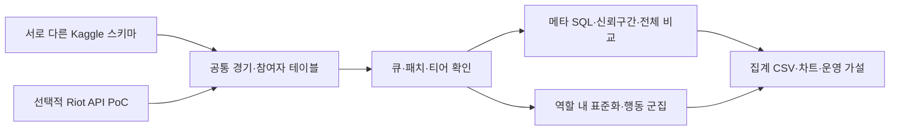
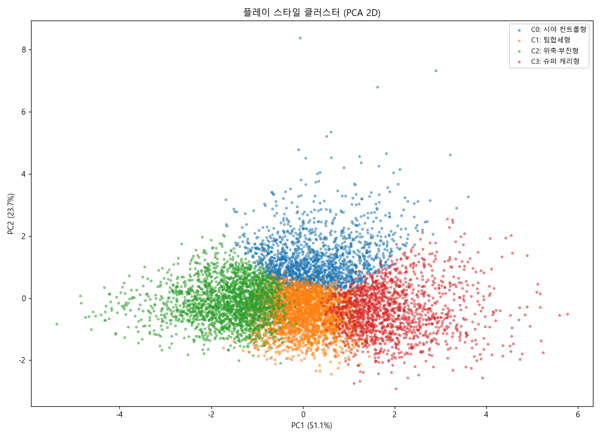

# LoL 패치 메타 변화와 경기별 행동 유형 분석


EUN 솔로듀오 두 패치의 경기 데이터를 공통 스키마로 적재하고, **챔피언 선택 변화·메타 다양성·경기별 행동 유형**을 SQL과 Python으로 분석했습니다. 표본의 티어 구성을 제한한 비교와 전체 표본 비교를 나란히 제시해 해석의 민감도를 확인했습니다.

## 프로젝트 한눈에 보기

| 항목 | 내용 |
|---|---|
| 의사결정 문제 | 어떤 메타 신호를 추가 점검하고, 경기별 행동 패턴을 어떻게 구분할 것인가? |
| 작업 | 2026년 5월, 단독 프로젝트 |
| 데이터 | EUN 솔로듀오 8,358경기·83,566행, 패치 15.1·15.3 위주 표본 |
| 분석 | SQLite 정규화 · SQL CTE·윈도우 함수 · 비율 신뢰구간 · HHI/Gini · 역할 내 표준화·K-means |
| 도구 | Python · pandas · scikit-learn · SQLite · matplotlib · Riot API |
| 산출물 | [분석·대시보드 CSV와 차트](outputs/) · [SQL](sql/) · [대시보드 설계](docs/05_dashboard_plan.md) · [API PoC](api/README.md) |
| 본인 역할 | 데이터 적재·SQL 분석·통계 해석·행동 군집·시각화·API 수집 PoC 전반 |
| 공개 범위 | 코드·파생 산출물·설계 기록. Kaggle 원본·SQLite DB·실제 API 키·수집 DB 제외 |

## 핵심 결과와 활용 제안

| 관측 결과 | 해석 | 제안 |
|---|---|---|
| 이즈리얼 픽률 변화 전체 `+0.35%p`, 공통 티어 `+0.13%p` | 비교 표본에 따라 변화량·순위가 달라짐 | 전체와 PLATINUM·EMERALD·DIAMOND 코호트를 함께 보고 추가 표본 확인 |
| BOT HHI `+0.004`, Gini `+0.100` | 해당 표본에서 선택 집중도·불균등도가 상승 | 다양한 패치·지역에서 같은 패턴인지 점검 |
| K=4 행동 유형 비중 약 `20% / 34% / 27% / 19%` | 한 경기의 행동 프로필 군집 | 유형별 콘텐츠·지원 가설 설계. 지속적인 플레이어 성격으로 해석하지 않음 |
| 일부 변화와 15.3 패치 조정 방향이 일치 | 이미 공개된 패치와 사후 대조 | 정합성과 미일치 사례를 함께 검토. 사전 예측 정확도로 제시하지 않음 |

두 패치의 단일 관찰 비교입니다. 티어 제한은 비교 조건을 맞추는 방법이며 다른 교란을 제거하거나 패치의 인과효과를 추정한 결과가 아닙니다. 다수 챔피언 비교의 다중검정과 경기 내 관측 의존성도 추가 검토가 필요합니다.

## 분석 흐름과 주요 판단


```mermaid
flowchart LR
    A[서로 다른 Kaggle 스키마] --> B[공통 경기·참여자 테이블]
    B --> C[큐·패치·티어 확인]
    C --> D[메타 SQL·신뢰구간·전체 비교]
    C --> E[역할 내 표준화·행동 군집]
    D --> F[집계 CSV·차트·운영 가설]
    E --> F
    G[선택적 Riot API PoC] --> B
```

KDA·사망 수를 포함한 초기 군집이 승패에 가깝게 나뉘어, 행동 지표인 분당 골드·딜·시야·킬 관여율을 사용했습니다. 역할 내 표준화로 포지션 차이를 줄였습니다. K=2의 silhouette가 더 높았으나 해석 목적을 고려해 K=4를 선택했으므로, 통계적으로 최적의 군집 수라고 주장하지 않습니다.



행동 유형은 시야 관리형·교전 집중형·부진 위축형·주도 캐리형으로 해석했습니다. `player_segments.csv`라는 기존 파일명과 달리 분석 단위는 **경기×참여자**입니다. 같은 사람을 추적하는 안정적 식별자가 없어 플레이어 단위로 일반화하지 않습니다.

## 주요 문서와 파일 구조

| 경로 | 역할 |
|---|---|
| `src/` | 적재·검증·메타 분석·군집·대시보드 CSV 생성 |
| `sql/` | 스키마·뷰·집계·후보 규칙·패치 변화 쿼리 |
| `outputs/` | 저장된 파생 CSV·시각화 |
| `docs/` | 단계별 분석 근거·패치 대조·대시보드 설계 |
| `api/` | 별도 API 키로 실행하는 소량 수집 예제 |

- [데이터 적재·표본 점검](docs/01_phase1_notes.md) · [메타 분석](docs/02_phase2_notes.md)
- [행동 군집](docs/03_phase3_notes.md) · [공식 패치와 사후 대조](docs/04_patch_notes_match.md)
- [대시보드 설계](docs/05_dashboard_plan.md) · [API 사용법](api/README.md)

Looker Studio는 연결용 CSV와 설계안까지 포함합니다. 확인된 공개 대시보드 URL은 없습니다.

## 실행 조건과 확인 방법

Python 3.11 기준입니다. 원본은 별도 이용 조건에 따라 준비하고 `data/raw/2024.xlsx`의 `league_data.csv` 시트와 `data/raw/2025.csv`로 배치합니다. 파일명과 달리 연도 비교가 아니라 2025년 초 두 패치의 비교입니다.

```bash
python -m venv .venv
# macOS/Linux: source .venv/bin/activate
# Windows PowerShell: .\.venv\Scripts\Activate.ps1
pip install -r requirements.txt
python src/load.py
python src/run_validate.py
python src/run_meta.py
python src/segment.py
python src/build_dashboard_csv.py
python src/add_kr_names.py
```

원본 없이 저장된 CSV와 차트를 읽을 수 있지만 전체 분석을 재실행할 수는 없습니다. API PoC는 기존 EUN 분석과 별도 경로로 저장되며, 실행하려면 유효한 키·Riot ID·지역 설정이 필요합니다. [API 안내](api/README.md)를 참고하세요. 이번 점검에서는 API 호출·데이터 재수집을 수행하지 않았습니다.

## 한계와 후속 검증

- 단일 지역·두 패치 표본이며 패치 효과의 인과 추정이나 사전 예측 평가가 아닙니다.
- 패치 노트에 변경이 없다는 이유만으로 관측 변화를 표본 노이즈로 확정할 수 없습니다. 아이템·상대 조합 등 다른 요인을 확인해야 합니다.
- 밴 데이터가 없어 픽·승률 중심이며 자동 후보 규칙에는 사각지대가 있습니다.
- 게임별 행동 유형을 플레이어 리텐션·고정 성향으로 연결하려면 별도 식별자와 종단 검증이 필요합니다.
- 소량 API PoC의 동작 기록은 대규모 수집·운영 안정성 검증과 구분합니다.

## 참고

[라이엇 공식 2025.S1.3 패치 노트](https://www.leagueoflegends.com/ko-kr/news/game-updates/patch-2025-s1-3-notes/) · [Riot Developer Portal](https://developer.riotgames.com/)

최진원 · [GitHub](https://github.com/jinwon25)
