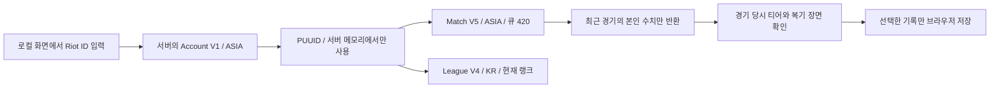

# 본인 전적 API 연결 검토

확인일: 2026-10-04. 첫 연결은 **로컬에서 본인의 완료 KR 솔로듀오 경기를 조회하는 Riot 공식 API**다. 공개 코드와 실제 이용자에게 공개 운영하는 서비스는 구분한다.

## 방식 비교

| 방식 | 확인한 지원·제약 | 판단 |
| --- | --- | --- |
| Riot Web API | 공식 계정·랭크·경기 상세·타임라인 API, 서버 키와 호출 제한 필요 | 본인 복기의 기본 경로 |
| OP.GG 데이터 이용 | [공식 도움말](https://help.op.gg/hc/en-us/articles/31091405109401-Can-I-use-OP-GG-data)은 수집 데이터를 제3자에게 제공하지 않는다고 안내. 스크래핑에 대한 일반 안내도 있지만 접근을 보장하지 않음 | 사용자 전적 URL은 이 환경에서 403. 차단을 우회하거나 비공개 웹 API를 연결하지 않음 |
| 제3자가 판매하는 “OP.GG API” | OP.GG가 제공·승인한 공개 데이터 API로 확인되지 않음 | 공식성·안정성·이용 조건이 확인되지 않아 채택하지 않음 |
| League Client / Live Client / Replay API | [공식 LoL 문서](https://developer.riotgames.com/docs/lol)의 로컬 클라이언트 기능. League Client API는 제3자 사용에 대한 공식 지원 보장이 없음 | 현재 완료 경기 웹 복기에는 필요하지 않음. 리플레이 조작 API와 원격 경기 타임라인은 별개 |
| RSO 로그인 | 공식 계정 로그인 연동은 프로덕션 키와 별도 절차 필요 | 본인 로컬 조회 이후의 공개 서비스 단계에서 검토 |

## 조회 흐름

실제 경로는 [공식 API 레퍼런스](https://developer.riotgames.com/apis)에서 확인했다.

| 용도 | 경로 | 이번 구현 |
| --- | --- | --- |
| Riot ID → PUUID | `ACCOUNT-V1 /riot/account/v1/accounts/by-riot-id/{gameName}/{tagLine}` | 구현 |
| 최근 랭크 목록 | `MATCH-V5 /lol/match/v5/matches/by-puuid/{puuid}/ids` | KR 솔로듀오 `queue=420`, 기본 5개·최대 10개 |
| 경기 상세 | `MATCH-V5 /lol/match/v5/matches/{matchId}` | 게임 버전·시간·본인 포지션/수치·팀 킬 요약 |
| 현재 랭크 | `LEAGUE-V4 /lol/league/v4/entries/by-puuid/{encryptedPUUID}` | 현재 솔로 랭크만 표시. 경기 당시 티어는 별도 입력 |
| 사건·시간대 | `MATCH-V5 /lol/match/v5/matches/{matchId}/timeline` | 후속 범위. 10·15분 CS/골드, 사망·아이템·오브젝트 사건의 가용성을 실전 응답에서 감사한 뒤 분석 |

경기 응답의 `gameVersion` 앞 두 자리, 예를 들어 `16.19`, 를 개인 비교 조건으로 사용한다. 공식 패치 노트의 `26.19` 표기와 자동으로 혼합하지 않는다. 종료 시각이 없는 오래된 응답은 제외하므로 `gameDuration`은 11.20 이후 기준인 초 단위로 처리한다. `teamPosition`은 서버가 추정한 포지션이며 역할 누락·짧은 경기·조기 종료는 복기 입력에서 제외한다.

## 키와 운영 범위

[Riot Portal 안내](https://developer.riotgames.com/docs/portal)에 따르면 개발 키는 24시간마다 비활성화된다. 본인·소규모 비공개 사용에는 제품 설명을 갖춘 개인 키를 신청할 수 있다. 개인 키 기본 한도는 지역별 초당 20회·2분당 100회다. 공개 이용과 공개 알파/베타에는 개인 키를 사용할 수 없으며 프로덕션 키가 필요하다. 키 발급·승인은 이 저장소가 보장하지 않는다.

### 개인 연구용 신청

[공식 포털 안내](https://support-developer.riotgames.com/hc/en-us/articles/22698431229203-Developer-Portal-Overview)는 개인 연구와 본인 전적 수집을 개인 키의 허용 용도로 명시한다. 24시간 주기 비활성화는 개발 키에 명시된 조건이다. 지속적인 본인 연구는 개인 키를 신청하는 방향이 적합하지만 키의 영구 유효성이나 자동 승인을 보장하는 의미는 아니다. [API 이용 조건](https://support-developer.riotgames.com/hc/en-us/articles/22698917218323-API-Terms-and-Conditions)에 따라 Riot은 키를 비활성화할 수 있다.

포털 홈에서 제품 등록을 열어 개인 프로젝트·League of Legends로 신청하고 다음과 같이 실제 사용 목적을 설명한다. 신청 제출·승인은 이 저장소 작업에서 수행하지 않았다.

> 본인 계정의 완료된 KR 솔로듀오 경기를 조회하고 경기별 골드·챔피언 피해·시야·킬 관여율을 분석하는 개인 연구용 로컬 웹 도구입니다. 같은 게임 버전·챔피언·포지션 등의 조건에서 본인의 경기 기록을 비교하고 리플레이에서 확인한 사실과 다음 경기의 행동 목표를 기록합니다. Account V1, Match V5, League V4를 사용합니다. 키는 서버에서만 사용하며 공개 코드에 포함하지 않습니다. 원본 전적·개인 식별자를 공개하거나 데이터를 판매하지 않습니다. 현재 일반 이용자에게 서비스를 공개 운영하지 않습니다.

타임라인이나 다른 기능을 추가할 때는 등록 설명도 실제 범위에 맞게 갱신한다. 공개 GitHub의 코드 열람과 실제 키를 사용한 공개 서비스 운영은 구별한다. 신청 후 승인된 개인 키를 기존 로컬 `service/.env`에 설정하면 된다.

현재 구현은 단일 로컬 프로세스를 전제로 한 보수적인 요청 제한, Riot `429`의 `Retry-After` 대기 안내와 재요청 제한, 60초 메모리 캐시를 사용한다. 자동 재시도로 호출을 늘리지 않는다. 여러 서버·여러 이용자의 한도 공유, 인증, 지속 캐시와 데이터 수명 관리는 공개 운영 전에 별도로 구현해야 한다.

키는 `X-Riot-Token` 서버 헤더로만 보내고 브라우저·URL·응답·공개 코드에 넣지 않는다. 연결 경로는 로컬 클라이언트·로컬 Host·동일 Origin으로 제한하고 `Cache-Control: no-store`를 적용한다. 원본 전적·PUUID·타인의 행은 디스크에 저장하거나 프런트엔드로 반환하지 않는다. 사용자가 명시적으로 저장한 복기 수치·장면·행동은 해당 브라우저에만 남는다.

[Riot 일반 정책](https://developer.riotgames.com/policies/general)에 맞게 서비스 등록과 기능 변경의 검토 범위를 확인해야 한다. 비공식 서비스 고지는 화면 하단에 표시했다. 숨겨진 실력 점수나 게임 중 알려지지 않은 정보의 노출은 구현하지 않는다.

## 실제 확인과 남은 검증

연결의 라우팅·키 전달·캐시·429·개인정보 반환 제외·입력 경계·브라우저 가져오기는 모의 응답으로 검증했다. **2026-10-04 유효한 로컬 키로 실제 계정 응답·현재 랭크·최근 경기 조회와 복기 입력 검증을 확인했다.** 계정 응답의 게임 이름·태그를 요청한 Riot ID와 대조했다. 조회된 계정과 키 발급자의 소유 관계는 별개이며 키 소유자는 일반 Account API 응답으로 확인하지 않는다.

실제 키·계정 ID·PUUID·경기 원본·개인 화면 캡처는 공개 저장소에 포함하지 않았다. 소량 조회 성공은 대규모 수집·전체 필드의 정확성·장기 운영·공개 서비스 승인을 뜻하지 않는다. 경기 당시 티어와 리플레이 장면의 수동 대조, 데이터 누락 감사와 타임라인 분석은 후속 검증이다.

권장 실행 명령의 `--env-file service/.env`로 실제 키를 읽고 브라우저에서 경기 가져오기·복기 요약 제출까지 확인했다. API는 경기 시간을 분 단위 소수 둘째 자리로 반환하므로 입력의 `step`도 `0.01`로 맞췄다. 기존 `0.1` 제한은 실제 경기 가져오기 후 HTML 검증에서 제출을 막았다. 소수 둘째 자리 모의 응답을 포함한 브라우저 회귀 검증과 실제 응답으로 수정 결과를 확인했다.

타임라인만으로 영상의 모든 장면·의도·스킬 적중·시야 가시성을 복원할 수 있다고 가정하지 않는다. 원딜의 웨이브·귀환·교전 선택 분석은 실제 제공 필드를 확인하고 사용자가 기록한 장면과 대조한 뒤 확장한다.

[로컬 키 설정·실행](../service/README.md) · [개인 복기 방향](07_service_benchmark.md)
